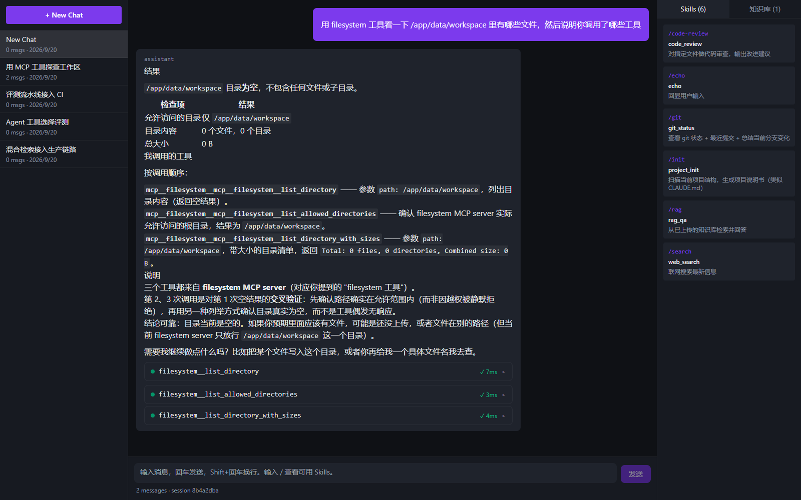
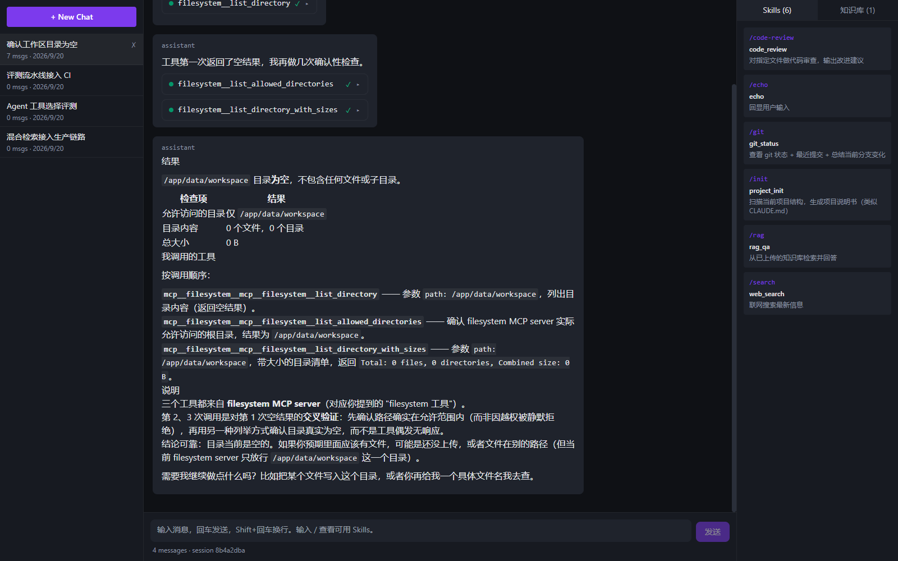

# 测试报告

> 生成时间：2026-09-20
> 覆盖范围：`backend/app`、`backend/eval`、`backend/scripts`
> 验证环境：Python 3.13 独立虚拟环境 + Docker Compose 全量服务（PostgreSQL / Qdrant 均已验证）

## 1. 结论

| 指标 | 结果 |
|---|---|
| 用例总数 | **270（270 通过 / 0 跳过 / 0 失败）** |
| 语句覆盖率 | **73%**（2730 语句，746 未覆盖） |
| 默认套件（无外部服务） | 251 个通过 / 18 个跳过，约 14 秒 |
| 需 PostgreSQL / Qdrant | 18 个用例，用 `pytest --run-integration` 触发，**已在真实服务上全部跑通** |
| 静态检查 | `ruff check --select E4,E7,E9,F`（范围含被改动的核心文件）全绿 |

> 演进：初版（Docker 未启动）211 通过 / 17 跳过 / 65%；接入真实服务后 234 通过 / 0 跳过 / 70%；
> 补上混合检索的生产接线与评测指标测试后 262 通过 / 70%；
> 修掉「工具调用轨迹不落库」并让集成测试改跑独立库后 **270 通过 / 73%**。

覆盖率按模块分布（关键模块）：

| 模块 | 覆盖率 | 说明 |
|---|---|---|
| `core/agent.py` | 93% | Agent 循环、工具路由、失败兜底 |
| `core/context.py` | 98% | 上下文组装与摘要压缩 |
| `core/retry.py` | 99% | 重试 / 超时 / 熔断 |
| `core/prompt_store.py` | 96% | Prompt 版本与 A/B 分流 |
| `core/memory.py` | 100% | 工作记忆；长期记忆为占位实现 |
| `rag/hybrid.py` | 100% | 混合检索、分数融合、MMR |
| `rag/corpus_index.py` | 98% | 词法索引的滚动重建与降级 |
| `rag/retriever.py` | 79% | 生产检索入口与混合/纯向量切换 |
| `rag/lexical.py` | 96% | BM25 + 中英文分词 |
| `rag/ingest.py` | 96% | 入库流水线 |
| `observability/cost.py` | 97% | token / 成本计量 |
| `feedback/service.py` | 95% | 反馈收集与坏例导出 |
| `rag/qdrant_store.py` | **63%** | 真实 Qdrant 集成测试（部分分支需多 collection 场景） |
| `api/sessions.py` | 71% | HTTP 层会话 CRUD + 工具调用序列化（上一版 49%） |
| `core/llm.py` | 41% | 依赖真实 API，仅覆盖构造与错误路径 |
| `api/chat.py` | 39% | SSE 全链路需要把 Agent 一起拉起 |

## 2. 测试分层

```
backend/tests/
├── conftest.py                  # 环境变量预置、CLI 开关、公共 fixture
├── fakes/
│   └── fake_llm.py              # FakeLLM：按脚本产出 content / tool_calls
├── unit/                        # 纯逻辑，无外部依赖
│   ├── test_token_counter.py    分块
│   ├── test_chunker.py          切分与文件类型识别
│   ├── test_context.py          上下文组装 / 摘要压缩
│   ├── test_skill_registry.py   Skills 加载与注册
│   ├── test_retry.py            重试 / 超时 / 熔断状态机
│   ├── test_hybrid_retrieval.py BM25 / 融合 / MMR / 混合检索
│   ├── test_prompt_store.py     Prompt 版本与 A/B 分流
│   ├── test_cost_tracker.py     token 与成本计量
│   ├── test_feedback.py         反馈收集与导出
│   ├── test_memory.py           工作记忆
│   ├── test_streaming.py        SSE 打包
│   ├── test_ingest.py           入库流水线与 Retriever
│   ├── test_retriever_wiring.py 生产混合检索链路的接线与降级
│   ├── test_eval_metrics.py     Agent / 生成评测指标
│   ├── test_session_serialization.py 工具调用在存储与 UI 两种形状间的转换
│   ├── test_mcp_config.py       MCP server 配置加载
│   ├── test_errors.py           异常体系与全局处理器
│   └── test_schemas.py          Pydantic 契约
├── integration/                 # 多组件联调
│   ├── test_agent_loop.py       Agent 循环（不需要外部服务）
│   ├── test_db_persistence.py   PostgreSQL（标记 integration）
│   └── test_qdrant_rag.py       Qdrant（标记 integration）
└── e2e/
    └── test_smoke.py            HTTP 层冒烟
```

## 3. 核心基建：FakeLLM

Agent Loop 是一个带外部依赖的异步状态机，不把模型换掉就没法测。`tests/fakes/fake_llm.py`
提供一个可编排的假模型：

```python
llm = FakeLLM(script=[
    tool_step("skill_echo", {"text": "ping"}),   # 第一轮：要求调用工具
    content_step("回声完成"),                     # 第二轮：给出最终答案
])
```

它同时实现 `chat()` 与 `stream()`，并记录每一次调用的 `messages` / `tools`，因此可以断言：

- 循环轮数与 `max_iterations` 行为
- `skill_` / `mcp__` / `rag_search` 三类工具的路由是否正确
- 工具结果是否以 `role=tool` 正确回喂
- 超预算时是否触发摘要压缩
- 工具失败是否被记录为 `status=error` 且不打断循环

**收益：Agent 循环的回归测试不花钱、不联网、结果可复现。**

## 4. 运行方式

```bash
cd backend

pytest -q                        # 单元 + 联调 + e2e（无需外部服务）
pytest -q --run-integration      # 额外跑需要 PostgreSQL / Qdrant 的用例
pytest -q --run-live             # 额外跑真实 LLM 调用用例（会产生费用）
pytest -q --cov=app --cov-report=term-missing
```

或在仓库根目录：

```bash
make test                        # 等价于上面的第一条
make test-integration            # 追加 PostgreSQL / Qdrant 用例
make test-cov                    # 带覆盖率报告
make backend-test                # 在运行中的容器里跑（首次会自动装 pytest；无需本地 Python）
```

> 容器镜像只装运行时依赖，且不含 `tests/` `eval/` `scripts/`——compose 通过 bind mount 把三者挂进去，
> 所以 `make backend-test` 既能用，也不会把测试代码打进要发布的镜像。

> 若依赖装在虚拟环境里：`make test PY=<venv>/Scripts/python`

### 环境变量

`app.config.Settings` 在 import 时就会实例化，且 `openai_api_key` 是必填字段。
`tests/conftest.py` 在任何 `app.*` 导入之前调用 `os.environ.setdefault(...)` 注入占位值，
因此测试不依赖真实密钥。真实密钥优先级更高（pydantic-settings 中环境变量优先于 `.env`）。

### 集成测试的服务地址

| 服务 | 容器网络内 | 宿主机 |
|---|---|---|
| PostgreSQL | `postgres:5432` | `localhost:5432` |
| Qdrant | `qdrant:6333` | `localhost:16333`（Windows 上 6333 落在 Hyper-V 保留端口区间） |

集成测试会在服务不可达时 **skip** 而不是 fail，保证默认套件永远可跑。

### 测试库隔离

数据库类集成测试**不碰开发库**：夹具把连接串派生为 `<db>_test`（默认 `minicloud_test`）并自动建库，
开发库的 `alembic_version` 因此不会被 `Base.metadata.create_all` 带偏。
违反这条会让下一次 `alembic upgrade head` 直接失败——见第 5 节。

## 5. 已发现并修复的问题

| 问题 | 位置 | 现象 | 处理 |
|---|---|---|---|
| `tests/` 目录完全不存在 | 工程结构 | 无任何测试可跑 | 新建分层测试目录（`unit` / `integration` / `e2e`），并把本地 pytest 与容器内 pytest 拆成两个 target |
| pytest 会把**目录名**写入 `item.keywords` | `conftest.py` | 按关键字判断会把 `tests/integration/` 下所有用例（含不需要外部服务的 Agent 循环测试）一并跳过 | 改用 `item.get_closest_marker("integration")` 判断；修复后 `agent.py` 覆盖率 18% → 93% |
| 测试桩里 `results or [...默认值]` 会把"故意返回空列表"吞掉 | `test_agent_loop.py` | `StubRetriever(results=[])` 静默返回默认结果，空命中路径根本没被测到 | 改为 `results if results is not None else [...]` |
| `Makefile` 的 `help` 里写了 `make test`，但没有对应规则 | `Makefile` | 照文档执行直接报错 | 补齐 `test` / `test-cov` / `test-integration` |
| 无 CI | 工程结构 | 改动是否破坏既有能力只能靠人肉回归 | 新增 `.github/workflows/ci.yml`：ruff → 生成黄金集 → pytest（覆盖率下限 55）→ 离线评测 → 上传报告 |
| **混合检索没有接进生产链路** | `app/rag/retriever.py` | `retrieve()` 直接调 `QdrantStore.search()`（纯向量），`HybridRetriever` 只在 `eval/runner.py` 里被引过一次——评测报告里那些数字描述的是一条**产品从未真正跑过**的流水线 | 新增 `rag/corpus_index.py` 从 Qdrant 滚动重建 BM25 索引，`Retriever` 按 `rag_hybrid_enabled` 走混合链路且异常时退回纯向量；新增 `tests/unit/test_retriever_wiring.py` 11 个用例锁住这条接线 |
| **Agent / 生成评测指标是死代码** | `eval/metrics/agent.py`、`generation.py` | `runner.py` 只 import 了 `evaluate_retrieval`，`agent_tasks.jsonl`（20 条）从未被加载 | 新增 `eval/online_runner.py` 跑真实 Agent 循环与生成 groundedness，两份报告落 `eval/reports/` |
| `task_success_rate` 把"没声明 `must_contain`"算成失败 | `eval/metrics/agent.py` | 20 条任务里只有 5 条声明了断言，指标因此变成在数"多少条写了断言"，与 Agent 能力无关 | 只统计声明了断言的任务，并单独报告 `task_success_n` |
| **工具调用轨迹从不落库** | `app/core/agent.py`、`app/api/chat.py` | 带工具调用的一轮只写进内存 `working_messages`；即使落库也只传 `content`，`tool_calls` 被 `save_msg(**_ )` 丢掉。后果有三：重开会话时工具卡片全部消失、回喂模型的历史缺少自己的工具调用、DB 里查不到任何工具轨迹 | `agent.py` 在请求工具与收到结果时各落库一条；`chat.py` 的 `save_msg` 显式透传 `tool_calls` / `tool_call_id` / `name`；`_load_history` 保留 provider 形状（`content=None`）以便回喂；`sessions` API 侧用 `_flatten_tool_calls()` 转成前端要的扁平形状。回归用例：`test_tool_trajectory_is_persisted_not_just_kept_in_memory`、`test_parallel_tool_calls_each_get_their_own_saved_result`、`test_tool_trajectory_survives_storage_and_history_replay`、`test_session_serialization.py`（4 例） |
| **`make backend-test` 必然失败** | `Makefile`、`docker-compose.yml` | 运行时镜像只装 `project.dependencies`，Dockerfile 也从不 `COPY tests`——容器里既没有 pytest 也没有测试文件，README 却把它列为可用命令 | compose 把 `tests/` `eval/` `scripts/` bind mount 进容器（不进镜像），target 先幂等安装 pytest 再执行。容器内 `--run-integration` 实测 270 通过 / 73% |
| **集成测试直接污染开发库** | `tests/integration/test_db_persistence.py` | 夹具对 `settings.database_url`（开发库）执行 `Base.metadata.create_all`，把 `0002` 迁移才该建的表提前建好。下一次 `alembic upgrade head`（即下次容器启动）直接 `DuplicateTableError: relation "llm_usage" already exists`，**服务起不来** | 测试改用独立的 `minicloud_test` 库：`conftest.py` 预置 `POSTGRES_DB`，夹具按 `<db>_test` 派生连接串并自动建库。开发库的 `alembic_version` 用 `stamp head` 对齐后恢复正常启动 |

「工具调用轨迹从不落库」的验证方式：新开一轮带工具调用的对话并**刷新页面**后，
轨迹与卡片完整还原（下方左为实时、右为刷新后），这条链路此前会丢失全部卡片。





### 5.1 真实服务跑通后才暴露的缺陷

这两个问题在纯离线套件里**不可能被发现**——它们只在接上生产组件时才触发：

| 问题 | 位置 | 现象 | 处理 |
|---|---|---|---|
| 融合层硬编码 `hit["id"]` | `app/rag/hybrid.py` | 生产 `QdrantStore.search()` 只返回 `doc_id` + `chunk_index`，**不返回 `id`**，接上真实 Qdrant 后 `KeyError: 'id'` 直接崩 | 新增 `hit_id()` 按优先级解析（`id` → `chunk_id`/`point_id` → `doc_id#chunk_index` → 文本摘要），并把 `doc_id`/`chunk_index` 回填进 metadata 供引用使用；无法定位的命中直接丢弃，避免全部塌进同一个 `""` 桶 |
| 集成测试复用进程级单例引擎 | `tests/integration/test_db_persistence.py` | `get_engine()` 是进程级单例，asyncpg 连接绑定在首次创建的事件循环上；pytest-asyncio 每个用例换新循环，第二个用例起报 `'NoneType' object has no attribute 'send'`，5 个 PG 用例全部跳过 | 改为每个用例自建 `NullPool` 引擎并在结束时 `dispose()`，连接在用例自己的循环内开关。**生产代码无需改动**——FastAPI 只有一个事件循环，单例池是正确的 |

两个缺陷都已补上回归用例：`test_fuse_candidates_handles_qdrant_shaped_hits`、`test_fuse_candidates_drops_unidentifiable_hits`，
以及 `hit_id()` 的 4 个解析优先级用例。

## 6. 已知未覆盖 / 下一步

- `app/core/llm.py`、`app/mcp/client.py`、`app/api/chat.py`、`app/main.py` 的覆盖率依赖真实 API / 真实子进程，
  属于"无法离线验证"的部分。`main.py` 为 0% 是因为它的 lifespan 会拉起 MCP 子进程，冒烟测试改用裸 FastAPI 实例只挂 health + skills 路由。
- 历史遗留的未使用 import（lint 规则 F401）共 11 处，本次顺手清掉了改动文件里的 3 处
  （`chat.py` 的 `json` / `timezone`、`agent.py` 的 `uuid4`），其余 8 处仍在；
  CI 的 lint 范围已从"仅新增模块"扩到 `app/core/agent.py`、`app/api/chat.py`、`app/api/sessions.py`、`app/rag/retriever.py`，
  保证被改过的文件不再积累新债。
- 尚未覆盖：SSE 全链路（需要把 `/api/v1/chat/stream` 与 Agent 一起拉起）、MCP 真实子进程通信。
